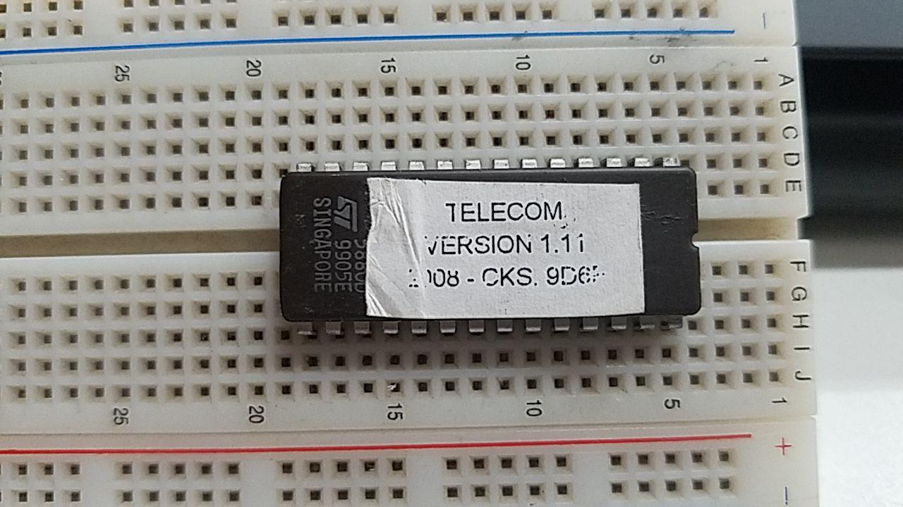
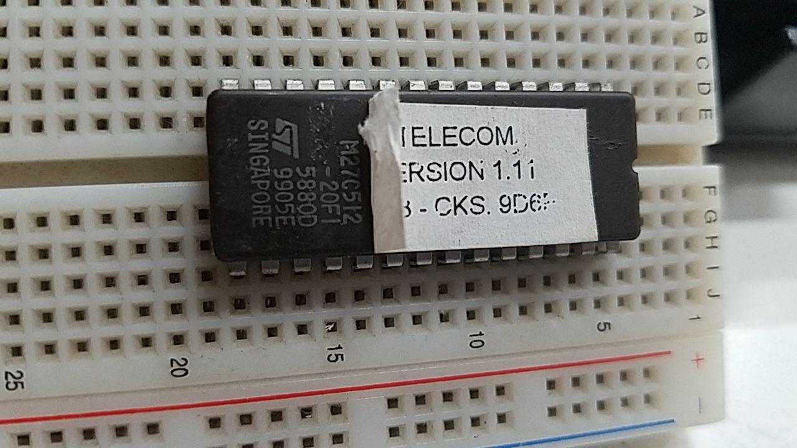
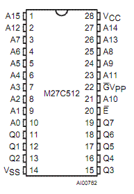
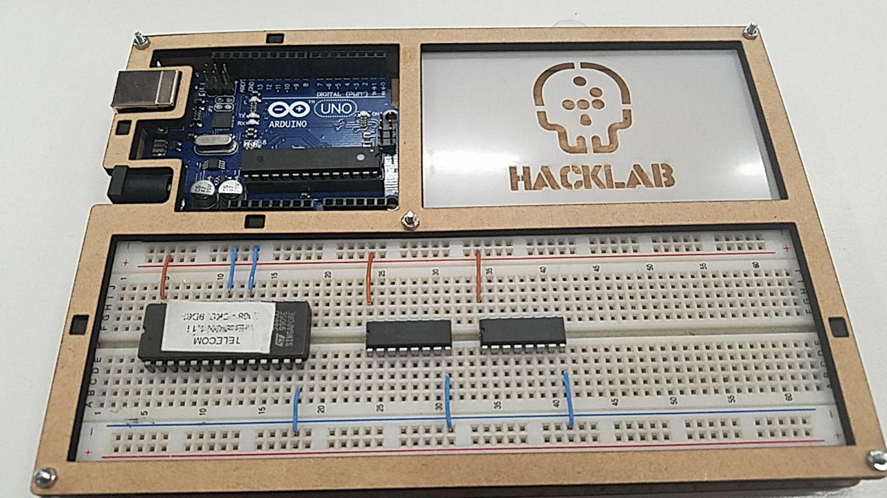
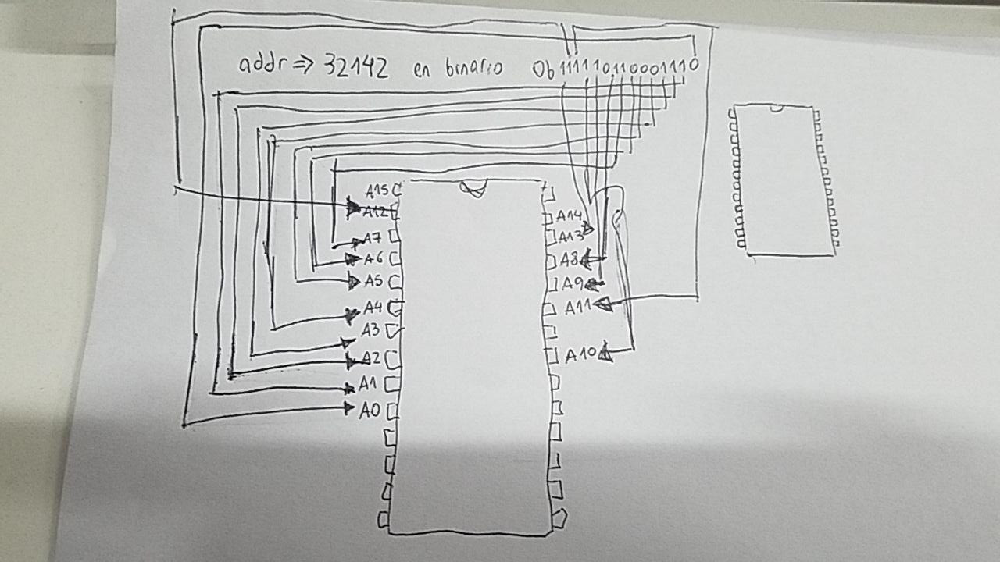
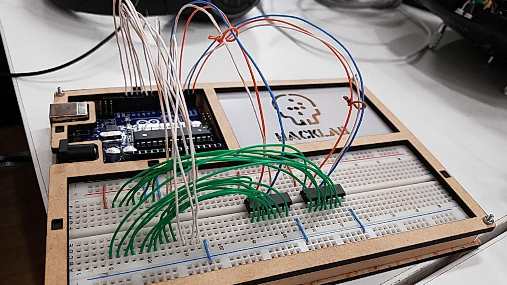
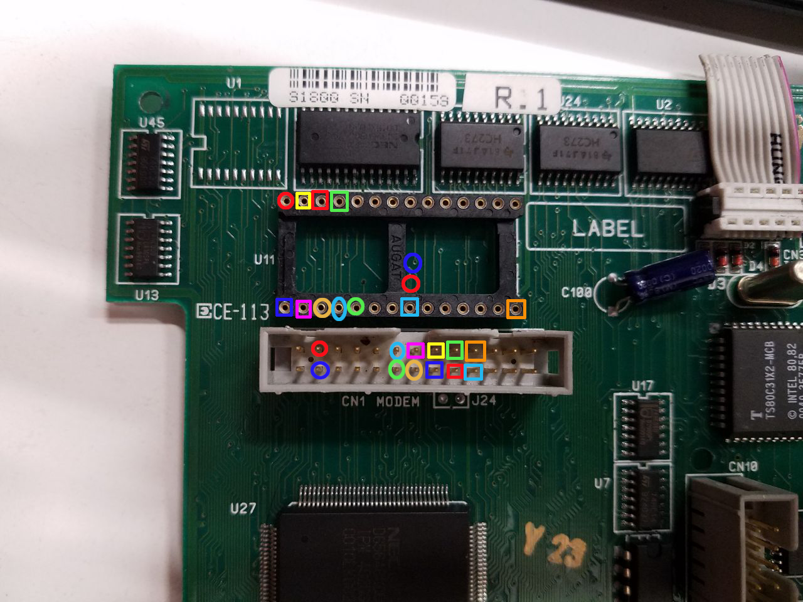
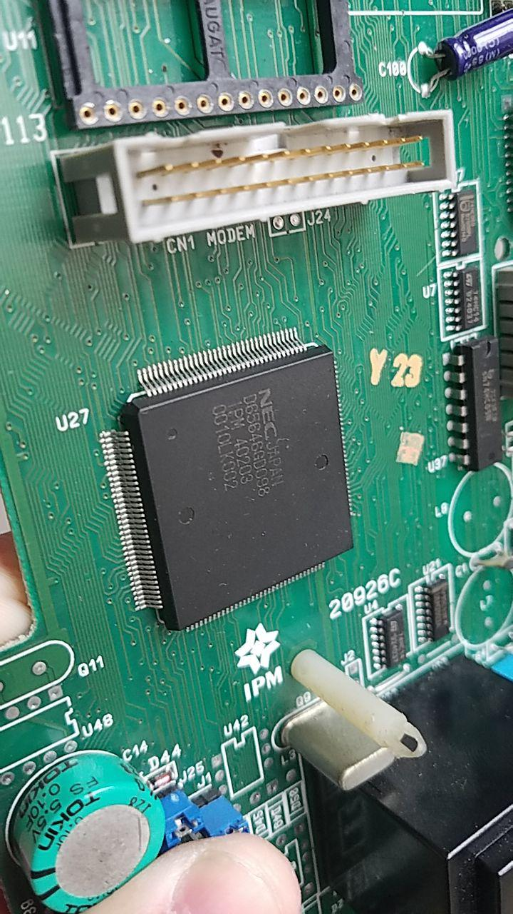
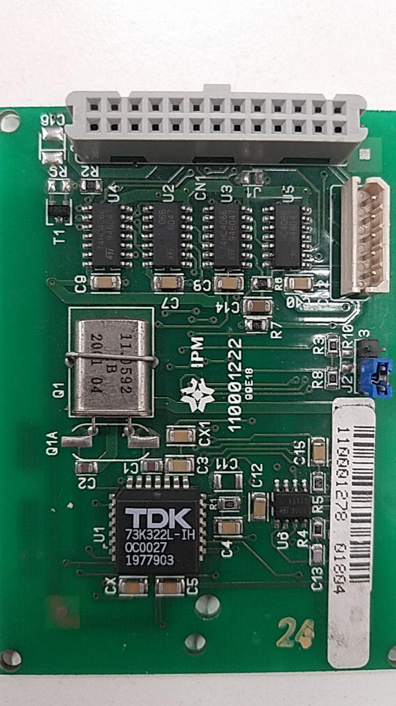

# Dumpear una ROM 101

el telefono nos trajo una ROM, unas fotitos de la susodicha:



para ver los numeritos corremos un poco el papel (sin sacarlo todo porque estos chips tienen un agujerito para grabarlos con rayos UV)



el pinout de esa memoria es:



el 512 del titulito es la cantidad de kilobits que puede soportar, si queremos saber la cantidad de kilobytes... lo tenemos que dividir por 8

por lo tanto este chip tiene soporte para:

```
>>> 512//8
64
```

64 KB de memoria, lista para ser dumpeada

* Vcc pin: derecho a +5V
* GND pin: a ground
* Vpp pin: programming voltage pin, a +5V (unless it's also one of the enable pings; see below)
* The remaining pins labelled "E", "OE", "G", "CE", etc. are pins that enable the input and outputs. All you really need to know about these is that they need to be enabled, and that they are active low. This means you tell the chip to enable these pins by hooking themup to ground, not +5V. You can tell that they're active low because they either have a hash mark (#) beside their names, or a little horizontal bar is drawn over their names.

## Breadboarding

Vcc y Vpp va a +5V, y todo lo demas que no sea A# o Q# va a ground



ahora los pins A0-A15 van del 26-41 del arduino en orden 


y Q0-Q7 desde el 2-10 del arduino mega


y ahora alimentamos los +5V y el GND a la breadboard para alimentar la placa

## Software

hay que bajar este sketch

```arduino
#include <stdint.h>

// Set MAX_ADDR to the largest address you need
// to read. For example, for the 27C512 chips,
// you'll want to use a MAX_ADDR of 65536.
// (That's 512 * 1024 / 8.)
// A 27C256 would be 256 kilobits, or 256 * 1024 / 8 =
// 32768.
#define MAX_ADDR 65536L

// On my board, I've connected pins 26-41
// to the A0-A15 lines, and pins 2-10 to the
// Q0-Q7 lines. You'll want to change these
// pin choices to match your setup.
#define A0 26
#define Q0 2

// When you're all wired up, hit the reset button
// to start dumping the hex codes.

void setup() {
  for (int i = A0; i < A0+16; i++) {
    digitalWrite(i,LOW);
    pinMode(i, OUTPUT);
  }
  for (int i = Q0; i < Q0+8; i++) {
    digitalWrite(i,HIGH);
    pinMode(i, INPUT);
  }
  Serial.begin(115200);
}

void writeAddr(uint32_t addr) {
  uint32_t mask = 0x01;
  for (int i = A0; i < A0+16; i++) {
    if ((mask & addr) != 0) {
      digitalWrite(i,HIGH);
    } else { 
      digitalWrite(i,LOW);
    }
    mask = mask << 1;
  }
}


uint8_t readByte() {
  uint8_t data = 0;
  uint8_t mask = 0x1;
  for (int i = Q0; i < Q0+8; i++) {
    if (digitalRead(i) == HIGH) {
      data |= mask;
    }
    mask = mask << 1;
  }
  return data;
}

void loop() {
  uint32_t addr = 0;
  while (addr < MAX_ADDR) {
    for (int i = 0; i < 16; i++) {
      writeAddr(addr);
      uint8_t b = readByte();
      Serial.print(b, HEX);
      Serial.print(" ");
      addr++;
    }
    Serial.println("");
  }
  while (1) {}
}
```

### setup

```arduino
#define A0 26
#define Q0 2

void setup() {
  for (int i = A0; i < A0+16; i++) {
    digitalWrite(i,LOW);
    pinMode(i, OUTPUT);
  }
  for (int i = Q0; i < Q0+8; i++) {
    digitalWrite(i,HIGH);
    pinMode(i, INPUT);
  }
  Serial.begin(115200);
}
```

como conecto el pin A0-A15 a LOW y lo setea para que tire OUTPUT. Q0-Q7 hace lo opuesto, lo pone a HIGH y los setea como INPUT, por ultimo habilita la comunicacion serial para dumpearla ahi

### loop

```arduino
// Set MAX_ADDR to the largest address you need
// to read. For example, for the 27C512 chips,
// you'll want to use a MAX_ADDR of 65536.
// (That's 512 * 1024 / 8.)
// A 27C256 would be 256 kilobits, or 256 * 1024 / 8 =
// 32768.
#define MAX_ADDR 65536L

void loop() {
  uint32_t addr = 0;
  while (addr < MAX_ADDR) {
    for (int i = 0; i < 16; i++) {
      writeAddr(addr);
      uint8_t b = readByte();
      Serial.print(b, HEX);
      Serial.print(" ");
      addr++;
    }
    Serial.println("");
  }
  while (1) {}
}
```

va hasta la direccion 65535 leyendo de a un byte, para hacer eso solo manda la direccion a leer con la funcion writeAddr

```arduino
void writeAddr(uint32_t addr) {
  uint32_t mask = 0x01;
  for (int i = A0; i < A0+16; i++) {
    if ((mask & addr) != 0) {
      digitalWrite(i,HIGH);
    } else {
      digitalWrite(i,LOW);
    }
    mask = mask << 1;
  }
}
```

son direcciones de 16 bits por mas que se le pase un uint32\_t y lo que hace el codigo es enviar la direccion que le pasemos como argumento en formato binario a los pines A0-A15, en dibujito es esto



escribe la direccion y retorna al loop donde ejecuta readByte y lo printea por consola en HEXA

```arduino
uint8_t readByte() {
  uint8_t data = 0;
  uint8_t mask = 0x1;
  for (int i = Q0; i < Q0+8; i++) {
    if (digitalRead(i) == HIGH) {
      data |= mask;
    }
    mask = mask << 1;
  }
  return data;
}
```

y para leerlo hace algo parecido, itera por las salidas Q0-Q7 leyendo en binario y va armando el uint8\_t en base a si lee un uno o un cero


NOTA: no me salio bien con el arduino uno por la conversion serial/paralelo:



## la version que salio bien con el arduino mega

ahora si dumpeamos la memoria con el arduino mega sin escatimar pines


y usamos el siguiente codigo:

```arduino
#include <stdint.h>

// Set MAX_ADDR to the largest address you need
// to read. For example, for the 27C512 chips,
// you'll want to use a MAX_ADDR of 65536.
// (That's 512 * 1024 / 8.)
// A 27C256 would be 256 kilobits, or 256 * 1024 / 8 =
// 32768.
#define MAX_ADDR 65536L

// On my board, I've connected pins 26-41
// to the A0-A15 lines, and pins 2-10 to the
// Q0-Q7 lines. You'll want to change these
// pin choices to match your setup.
#define A0 26
#define Q0 2

// When you're all wired up, hit the reset button
// to start dumping the hex codes.

void setup() {
  for (int i = A0; i < A0+16; i++) {
    digitalWrite(i,LOW);
    pinMode(i, OUTPUT);
  }
  for (int i = Q0; i < Q0+8; i++) {
    digitalWrite(i,HIGH);
    pinMode(i, INPUT);
  }
  Serial.begin(115200);
}

void writeAddr(uint32_t addr) {
  uint32_t mask = 0x01;
  for (int i = A0; i < A0+16; i++) {
    if ((mask & addr) != 0) {
      digitalWrite(i,HIGH);
    } else { 
      digitalWrite(i,LOW);
    }
    mask = mask << 1;
  }
}


uint8_t readByte() {
  uint8_t data = 0;
  uint8_t mask = 0x1;
  for (int i = Q0; i < Q0+8; i++) {
    if (digitalRead(i) == HIGH) {
      data |= mask;
    }
    mask = mask << 1;
  }
  return data;
}

void loop() {
  uint32_t addr = 0;
  while (addr < MAX_ADDR) {
    for (int i = 0; i < 16; i++) {
      writeAddr(addr);
      uint8_t b = readByte();
      Serial.print(b, HEX);
      Serial.print(" ");
      addr++;
    }
    Serial.println("");
  }
  while (1) {}
}
```

esto nos escupe el hexa de cada posicion de memoria por el serial a 115200, configuramos todo y ya vemos como comienza a largar:

```
2 0 26 12 F CA 43 87 1 22 FF 2 33 E7 12 1C 
76 12 11 E2 22 EF C3 94 C 50 1 22 7F B 22 FF 
FF FF FF 2 54 CD 78 7F E4 F6 D8 FD 75 A0 0 75 
81 38 2 0 70 2 0 B5 E4 93 A3 F8 E4 93 A3 40 
3 F6 80 1 F2 8 DF F4 80 29 E4 93 A3 F8 54 7 
24 C C8 C3 33 C4 54 F 44 20 C8 83 40 4 F4 56 
80 1 46 F6 DF E4 80 B 1 2 4 8 10 20 40 80 
90 21 66 E4 7E 1 93 60 BC A3 FF 54 3F 30 E5 9 
54 1F FE E4 93 A3 60 1 E CF 54 C0 25 E0 60 A8 
40 B8 E4 93 A3 FA E4 93 A3 F8 E4 93 A3 C8 C5 82 
C8 CA C5 83 CA F0 A3 C8 C5 82 C8 CA C5 83 CA DF 
E9 DE E7 80 BE D2 4F C2 AF D2 88 D2 A9 43 87 80 
75 89 21 75 8A E3 75 8C FA E4 90 15 19 F0 75 8D 
F2 75 98 40 D2 8C D2 8E D2 A9 D2 AF 12 F 6E C2 
3B 12 10 14 12 0 3 90 4 B5 E0 54 BF F0 7E 0 
7F A 7D 0 7B 2 7A 1F 79 FB 12 EC EA C2 C 90 
80 7 E0 20 E2 4 7F 1 80 2 7F 0 78 2 EF F2 
D2 2C D2 1C 12 23 71 D2 11 90 17 96 E0 90 15 1A 
F0 E4 FF 12 45 33 90 1F 7F EF F0 20 E2 10 90 4 
B4 E0 44 10 F0 E4 FF 7D 4 12 45 65 80 C E4 FF 
90 1F 7F E0 44 4 FD 12 45 65 90 2 26 E0 70 E 
90 8 E3 74 C F0 90 8 E4 74 8 F0 80 C 90 8 
E3 74 D F0 90 8 E4 74 7 F0 90 2 28 E0 FF 70 
14 90 7 B6 74 E F0 90 7 B7 74 33 F0 90 7 B8 
74 C F0 80 2A EF B4 2 14 90 7 B6 74 C F0 90 
7 B7 74 33 F0 90 7 B8 74 C F0 80 12 90 7 B6 
74 C F0 90 7 B7 74 33 F0 90 7 B8 74 C F0 90 
2 33 E0 B4 1 4 7F 1 80 2 7F 0 90 15 1B EF 
F0 D2 25 12 AD 69 90 1F 81 EF F0 C2 25 E4 78 2D 
F2 8 F2 90 4 E0 E0 70 16 90 4 B4 E0 FF C4 13 
13 13 54 1 20 E0 8 90 80 7 E0 54 C0 60 11 C3 
```

el dumpeado completo esta en [](outputs/salida-mega.txt) si despues lo pasamos a binario con el comando:

```console
cat salida-mega.txt | grep -v '^$' | python3 hex2bin.py > telefono.rom
```

y ahora si le tiramos un strings, tenemos cosas copadas:

```console
g0(L
05%C
Qw@	
\"0S
$lxg
#."C
z"yX~
d*p90
dCpF
z"y`~
dP`F
d.`1
#.xg
" D8
`bxl
                 
"x	| }
z%y)~
z y	}
#.xx
$l"                
0008
o`et
dUp@
"0E	
"oooooo
"0]$
"q0-
;H0.
pE04B
dKp!S
"0'2x
d(p)x
dPp5
dPp9
dPpI
 ?t(
"0;	S
C[PW
 #	 $
 Bt2
C[PwC
C[P?S
C[PO
C[P#
-r.P
"123A456B789C*0#D
E3xu
.r-P
.r-P
.r-P
d$po
E3xp
`xxu
z yZ
MZxu
z yb
xq| }
z yZ
z ybx
z yq
z yqxu
K.0Q
Qixo
xrt-
T?xl
Saxu
}x$t-
x$t^
x$t]
}x$t-
x$t^
x$t]
}x$t-
x$t]
}x$t-
X2x$
x$t^
x$t]
}x$t-
d~p6
 RV~
rLxj
`(xl
d.Np
i`$u
0R%u
haxo
@"xo
`&xm
0Q^xg
rLxu
z	yT
_ =Z
$1xg
#. 5
$lxp
#."xi
$lxi
n`!{
#."xp
" P1
%"xl
`+d*`
dB`	
"N.U
RECV: Technical 
RECV: SysConfig 
RECV: Validator 
RECV: Prefixes  
RECV: Tariff 
RECV: Timings   
RECV: Charges   
RECV: Holiday   
RECV: Speeds    
RECV: Acceptance
RECV: BlackList 
RECV: WhiteList 
RECV: Group&Ver.
RECV: Time&Date 
RECV: Autocall  
RECV: Req. Test 
RECV: Req. Calls
RECV: Req. Cnt  
RECV: Hecho[
SEND: TTP Status
SEND: Versions  
SEND: Alarms    
SEND: Calls Area
SEND: Coin Cnt  
SEND: Call Cnt  
SEND: Hecho[
MINIROTOR       
LLAMANDO PMS[
Transf. de Datos
   OCUPADO...   
 Receiving Call 
    from PMS    
%b02u] 
     HECHO!     
ESPERE POR FAVOR
Lp@x{
P"x{
N`@t
'"xu
fx |
)x)|
)xA|
)xU|
Pvxt
n`!xk
$lxx
#."xq
z!yq
z!yq
"xrtF
p'xq
$lxs
#.xt
#.xr
"   STATO  %b1d0%b1d
%?u.%0?u
%l?u
SOLO EMERGENZA
CENTAVOS 
FUORI SERVIZIO
(( CHIAMATA ))
RISPOSTA
MANCANZA CREDITO
CHIAM. PROIBITA
CHIAM. GRATUITA
CHIAM. EMERGENZA
NON RESTITUISCE
PREMI NUM. [0-9
INSERISCI MONETE
RITIRA LE MONETE
CREDITO ESAURITO
CAMBIO CARTA
CARTA  SCADUTA
CARTA VUOTA
CARTA NON VALIDA
REINSERIRE CARTA
RITIRARE  CARTA
NUOVA CARTA
PREMERE IL TASTO
CARTE O MONETE
INSERIRE CARTA
RIMUOVERE CARTA
ATTENDERE PREGO
MINIMO:
EMERGENCY ONLY
CENTAVOS 
OUT OF ORDER
(( RING ))
ANSWERING
NO CREDIT
BARRED CALL
FREE  CALL
EMERGENCY CALL
NO REFUND
PRESS NUM. [0-9]
INSERT COINS
TAKE YOUR COINS
CREDIT EXPIRED
CHANGE  CARD
CARD EXPIRED
CARD IS EMPTY
INVALID CARD
WRONG  INSERTION
TAKE YOUR CARD
INSERT NEW CARD
PUSH READER KEY
CARD / COINS
INSERT CARD
REMOVE CARD
PLEASE WAIT
MINIMUM:
URG. SEULEMENT
CENTAVOS 
HORS SERVICE
(( SONNERIE ))
REPONSE     
CREDIT NECESS. 
NUMERO INTERDIT 
APPEL GRATUIT  
APPEL D'URGENCE 
SANS RESTE    
PRESSER N. [0-9]
INTR. DES PIECES
RETOUR DE PIECES
PLUS DE PIECES
CHANGEZ LA CARTE
CARTE INVALIDE
CREDIT EPUISE
INSERT. ERRONEE
RETIRER LA CARTE
NOUVELLE CARTE
PRESSEZ TOUCHE
CARTE ET PIECES
TEL. A CARTES
ATENDEZ SVP
MINIMUM:
SO EMERGENCIA
CENTAVOS 
FORA DE SERVICO
(( LIGACAO ))
ATENDENDO
NAO HA CREDITOS
LIGACAO BLOQUEAD
LIGACAO GRATIS
LIGACAO DE EMERG
 NAO HA TROCO 
APERTE NUM.[0-9]
INSERIR MOEDAS  
LEVE MOEDAS 
CREDITO ESGOTADO
TROQUE O CARTAO
CARTAO INVALIDO 
CARTAO EXPIRADO
ERRO NO CARTAO 
INSERCAO INCORR.
 RETIRE CARTAO  
NOVO CARTAO
APERTE O BOTAO
CARTAO/MOEDAS
INSERIR CARTAO
RETIRE CARTAO
FAVOR ESPERAR
MINIMO:
SOLO EMERGENCIAS
OCUPADO...
((LLAMADA))
RESPUESTA
SIN  CREDITO
LLAMADA PROHIB.
LLAMADA LIBRE
LLAMADA EMERG.
SIN DEVOLUCION
PULSE NUM. [0-9]
INGRESE MONEDAS
RETIRE MONEDAS
CREDITO AGOTADO
CAMBIAR TARJETA
TARJETA INVALIDA
TARJ. CONSUMIDA
INTROD. ERRONEA
RETIRAR TARJETA
 NUEVA TARJETA
PULSE LA TECLA
TARJETAS/MONEDAS
INSERTAR TARJETA
ATENDER P. FAVOR
T(xq
#."xs
#."xr
$lxr
$lxr
`]xq
`2d-`
d#p)
d*p1
y~xl
y=x;
yHx;
x@t 
xwtB
dD`+xh
F"xq
xwtC
xwtC
xwtB
xvtG
xwtC
"xrt
dD`	
xwtC
dD`2x7
yzxvt
xwtC
xwtB
xwtC
xvt	
xwtB
dD`	x7
y_x7
xwtB
dCpH{
dCpB
dCpB
dCpB
dCpB
dCpB
dCpB
kd-`	
@Cx2
yYx;
yYx;
yYx;
xut	
xut	
xut	
#+t#
d*pT
d#pG
yox;
z#y,
z#y,
pdxW|
x=|#}
z#y=~
E},|
G},|
k}i|
y>x7
xwtB
dD`i~
d0p(
xwtB
d#pk
d1p\
dD`8
dCpB
y4xvt
xwtC
yRxvt
xwtC
dD`Dx7
xwtC
0 DISCADO
1 LLAMADAS ENTR.
2 MONEDAS
3 DIA Y HORA
4 VAL.TARIFARIOS
5 NUM. RAPIDOS
6 PROHIB.-LIBRE
7 PABX Y POA
8 CLAVES
9 Codigo AT
0 VARIAS
1 TAMBOR
2 DISPLAY
3 RAM
4 ESTADO
5 MOVIMIENTOS
6 TECLADO
7 RELEVADORES
8 CONFIGURACION
9 TABLA DE PREF.
A CONTADORES
B RECAUDACION
C PAUSA DIAL
D CONNECTION STD
0 DIAL
1 MODEM SENDING
2 MODEM CONNECT
3 INCOMING CALL
4 TEST PIT
5 TEST VOLUME
6 TEST BATTERY
7 TELETAXE
8 LINE OFF
0 DISCADO
1 TELEFONO ID
2 PREFIJO TEL
3 NUMERO TEL
4 PREFIJO PMS
5 NUMERO PMS
6 PREDISCADO PMS
7 PABX Y POA
PULSO 60-40
PULSO 65-35
TONO
DESHABILITADO
HABILITADO
FECHA
HORA
LUNES    
MARTES   
MIERCOLES
JUEVES   
VIERNES  
SABADO   
DOMINGO  
NUMEROS PROHIB.
NUMEROS LIBRE
LIBRE
TASA LOCAL
TASA NACIONAL
TASA INTERNAC.
PROGRAM.
RECAUDAC.
OPERADOR
CONTROL
PABX PREFIJO
INTERNAC.
NACIONAL
EMERG. 1
EMERG. 2
ROTACION
ROTACION Y RECA.
ROTACION Y DEVO.
MF TONE
MF PULSE
PULSE 60-40
PULSE 65-35
IMPULSOS
AUTOTASACION
50 Hz
16 KHZ
12 KHZ
FICHAS ACEPTADA
FICHAS RECHAZADA
VALOR REMOTO
REDONDEO
CONSUMIDO
ENCAJONAMIENTO
ERROR  VALIDADOR
 ERROR  TECLADO 
                
ALCANCIA ALARM2 
ALCANCIA ALARM1 
  RAM AGOTADA   
ALERTA BATERIA 2
 SENSOR INGRESO 
 SENSOR DEVOLUC.
  ERROR  SAM    
  FLAP INGRESO  
SENSOR DE COBRO 
 FLAP DE COBRO  
  ERROR MOTOR   
  ERROR LECTOR  
  TECLA LECTOR  
ESCRIT.  TARJETA
 ERROR  I2C-BUS 
 PROBLEMA MICRO 
  PROBLEMA RTC  
   V/ ALCANCIA  
   ERROR  RAM   
CANAL  BLOQUEADO
 CANAL DE COBRO 
   SIN  LINEA   
 BATERIA ALARM  
PROGRAMAR SA
PROGRAMAR PMS
VALOR INCORRECTO
MANTENIMIENTO
INGRESE N. CLAVE
MINIROTOR       
%b2x.%b02x
%b02x/%b02x/%b02x%b02x
F3-PUESTA A CERO
PREFIJO
FINAL
RAM TEST:
     RAM OK     
   ERRORES RAM  
TEST RELEVADORES
ACCION
  SIN  ERRORES  
VARIAS
TEST MOVIMENTOS 
CONTADORES
%b1c
F1-Del    F4-Esc
PULSE UNA TECLA 
DATOS DE DEFAULT
      
580789
1.Reset 2.Instal
Total      %5u
Total 
1000000008
------
     BORRADO    
ENVIANDO:
Calling 40      
Handshake Fails
   Battery OK   
  Battery Low   
Pulses:
%3bu
0 sec.
0,1 sec.
0,5 sec.
1 sec.
2 sec.
3 sec.
5 sec.
7 sec.
10 sec.
15 sec.
V-22
V-21
AT On Free
50 CENT
25 CENT
10 CENT
05 CENT
COS.LOC
COS.NAC
1 PESO
  /  /  
##$C
##$C
4"x80[
MNOx {
'???
VrZrYP
(null)
-IXPDC
Ux50
N`>xt
```

hay cosas copadas, llego el mometno de tirarle un binwalk, ya al binario que lo dejamos en [](telefono.rom)

## error en la traduccion a binario

use un .py que me baje y parece que no anda del todo bien, entonces nos hicimos nuestro propia artesania:

```console
cat salida-mega3.txt | perl -ane 'foreach $c (@F) { print chr(hex($c)); }' > otro-algo2.bin
```

agarra cada numero hex y lo printea como caracter, todo redireccionado al file .bin, si miramos el hexdump ahora tiene mas pinta:

```console
g0(L
05%C
Qw@	
\"0S
$lxg
#."C
z"yX~
d*p90
dCpF
z"y`~
dP`F
d.`1
#.xg
" D8
`bxl
                 
"x	| }
z%y)~
z y	}
#.xx
$l"                
0008
o`et
dUp@
"0E	
"oooooo
"0]$
"q0-
;H0.
pE04B
dKp!S
"0'2x
d(p)x
dPp5
dPp9
dPpI
 ?t(
"0;	S
C[PW
 #	 $
 Bt2
C[PwC
C[P?S
C[PO
C[P#
-r.P
"123A456B789C*0#D
E3xu
.r-P
.r-P
.r-P
d$po
E3xp
`xxu
z yZ
MZxu
z yb
xq| }
z yZ
z ybx
z yq
z yqxu
K.0Q
Qixo
xrt-
T?xl
Saxu
}x$t-
x$t^
x$t]
}x$t-
x$t^
x$t]
}x$t-
x$t]
}x$t-
X2x$
x$t^
x$t]
}x$t-
d~p6
 RV~
rLxj
`(xl
d.Np
i`$u
0R%u
haxo
@"xo
`&xm
0Q^xg
rLxu
z	yT
_ =Z
$1xg
#. 5
$lxp
#."xi
$lxi
n`!{
#."xp
" P1
%"xl
`+d*`
dB`	
"N.U
RECV: Technical 
RECV: SysConfig 
RECV: Validator 
RECV: Prefixes  
RECV: Tariff 
RECV: Timings   
RECV: Charges   
RECV: Holiday   
RECV: Speeds    
RECV: Acceptance
RECV: BlackList 
RECV: WhiteList 
RECV: Group&Ver.
RECV: Time&Date 
RECV: Autocall  
RECV: Req. Test 
RECV: Req. Calls
RECV: Req. Cnt  
RECV: Hecho[
SEND: TTP Status
SEND: Versions  
SEND: Alarms    
SEND: Calls Area
SEND: Coin Cnt  
SEND: Call Cnt  
SEND: Hecho[
MINIROTOR       
LLAMANDO PMS[
Transf. de Datos
   OCUPADO...   
 Receiving Call 
    from PMS    
%b02u] 
     HECHO!     
ESPERE POR FAVOR
Lp@x{
P"x{
N`@t
'"xu
fx |
)x)|
)xA|
)xU|
Pvxt
n`!xk
$lxx
#."xq
z!yq
z!yq
"xrtF
p'xq
$lxs
#.xt
#.xr
"   STATO  %b1d0%b1d
%?u.%0?u
%l?u
SOLO EMERGENZA
CENTAVOS 
FUORI SERVIZIO
(( CHIAMATA ))
RISPOSTA
MANCANZA CREDITO
CHIAM. PROIBITA
CHIAM. GRATUITA
CHIAM. EMERGENZA
NON RESTITUISCE
PREMI NUM. [0-9
INSERISCI MONETE
RITIRA LE MONETE
CREDITO ESAURITO
CAMBIO CARTA
CARTA  SCADUTA
CARTA VUOTA
CARTA NON VALIDA
REINSERIRE CARTA
RITIRARE  CARTA
NUOVA CARTA
PREMERE IL TASTO
CARTE O MONETE
INSERIRE CARTA
RIMUOVERE CARTA
ATTENDERE PREGO
MINIMO:
EMERGENCY ONLY
CENTAVOS 
OUT OF ORDER
(( RING ))
ANSWERING
NO CREDIT
BARRED CALL
FREE  CALL
EMERGENCY CALL
NO REFUND
PRESS NUM. [0-9]
INSERT COINS
TAKE YOUR COINS
CREDIT EXPIRED
CHANGE  CARD
CARD EXPIRED
CARD IS EMPTY
INVALID CARD
WRONG  INSERTION
TAKE YOUR CARD
INSERT NEW CARD
PUSH READER KEY
CARD / COINS
INSERT CARD
REMOVE CARD
PLEASE WAIT
MINIMUM:
URG. SEULEMENT
CENTAVOS 
HORS SERVICE
(( SONNERIE ))
REPONSE     
CREDIT NECESS. 
NUMERO INTERDIT 
APPEL GRATUIT  
APPEL D'URGENCE 
SANS RESTE    
PRESSER N. [0-9]
INTR. DES PIECES
RETOUR DE PIECES
PLUS DE PIECES
CHANGEZ LA CARTE
CARTE INVALIDE
CREDIT EPUISE
INSERT. ERRONEE
RETIRER LA CARTE
NOUVELLE CARTE
PRESSEZ TOUCHE
CARTE ET PIECES
TEL. A CARTES
ATENDEZ SVP
MINIMUM:
SO EMERGENCIA
CENTAVOS 
FORA DE SERVICO
(( LIGACAO ))
ATENDENDO
NAO HA CREDITOS
LIGACAO BLOQUEAD
LIGACAO GRATIS
LIGACAO DE EMERG
 NAO HA TROCO 
APERTE NUM.[0-9]
INSERIR MOEDAS  
LEVE MOEDAS 
CREDITO ESGOTADO
TROQUE O CARTAO
CARTAO INVALIDO 
CARTAO EXPIRADO
ERRO NO CARTAO 
INSERCAO INCORR.
 RETIRE CARTAO  
NOVO CARTAO
APERTE O BOTAO
CARTAO/MOEDAS
INSERIR CARTAO
RETIRE CARTAO
FAVOR ESPERAR
MINIMO:
SOLO EMERGENCIAS
OCUPADO...
((LLAMADA))
RESPUESTA
SIN  CREDITO
LLAMADA PROHIB.
LLAMADA LIBRE
LLAMADA EMERG.
SIN DEVOLUCION
PULSE NUM. [0-9]
INGRESE MONEDAS
RETIRE MONEDAS
CREDITO AGOTADO
CAMBIAR TARJETA
TARJETA INVALIDA
TARJ. CONSUMIDA
INTROD. ERRONEA
RETIRAR TARJETA
 NUEVA TARJETA
PULSE LA TECLA
TARJETAS/MONEDAS
INSERTAR TARJETA
ATENDER P. FAVOR
T(xq
#."xs
#."xr
$lxr
$lxr
`]xq
`2d-`
d#p)
d*p1
y~xl
y=x;
yHx;
x@t 
xwtB
dD`+xh
F"xq
xwtC
xwtC
xwtB
xvtG
xwtC
"xrt
dD`	
xwtC
dD`2x7
yzxvt
xwtC
xwtB
xwtC
xvt	
xwtB
dD`	x7
y_x7
xwtB
dCpH{
dCpB
dCpB
dCpB
dCpB
dCpB
dCpB
kd-`	
@Cx2
yYx;
yYx;
yYx;
xut	
xut	
xut	
#+t#
d*pT
d#pG
yox;
z#y,
z#y,
pdxW|
x=|#}
z#y=~
E},|
G},|
k}i|
y>x7
xwtB
dD`i~
d0p(
xwtB
d#pk
d1p\
dD`8
dCpB
y4xvt
xwtC
yRxvt
xwtC
dD`Dx7
xwtC
0 DISCADO
1 LLAMADAS ENTR.
2 MONEDAS
3 DIA Y HORA
4 VAL.TARIFARIOS
5 NUM. RAPIDOS
6 PROHIB.-LIBRE
7 PABX Y POA
8 CLAVES
9 Codigo AT
0 VARIAS
1 TAMBOR
2 DISPLAY
3 RAM
4 ESTADO
5 MOVIMIENTOS
6 TECLADO
7 RELEVADORES
8 CONFIGURACION
9 TABLA DE PREF.
A CONTADORES
B RECAUDACION
C PAUSA DIAL
D CONNECTION STD
0 DIAL
1 MODEM SENDING
2 MODEM CONNECT
3 INCOMING CALL
4 TEST PIT
5 TEST VOLUME
6 TEST BATTERY
7 TELETAXE
8 LINE OFF
0 DISCADO
1 TELEFONO ID
2 PREFIJO TEL
3 NUMERO TEL
4 PREFIJO PMS
5 NUMERO PMS
6 PREDISCADO PMS
7 PABX Y POA
PULSO 60-40
PULSO 65-35
TONO
DESHABILITADO
HABILITADO
FECHA
HORA
LUNES    
MARTES   
MIERCOLES
JUEVES   
VIERNES  
SABADO   
DOMINGO  
NUMEROS PROHIB.
NUMEROS LIBRE
LIBRE
TASA LOCAL
TASA NACIONAL
TASA INTERNAC.
PROGRAM.
RECAUDAC.
OPERADOR
CONTROL
PABX PREFIJO
INTERNAC.
NACIONAL
EMERG. 1
EMERG. 2
ROTACION
ROTACION Y RECA.
ROTACION Y DEVO.
MF TONE
MF PULSE
PULSE 60-40
PULSE 65-35
IMPULSOS
AUTOTASACION
50 Hz
16 KHZ
12 KHZ
FICHAS ACEPTADA
FICHAS RECHAZADA
VALOR REMOTO
REDONDEO
CONSUMIDO
ENCAJONAMIENTO
ERROR  VALIDADOR
 ERROR  TECLADO 
                
ALCANCIA ALARM2 
ALCANCIA ALARM1 
  RAM AGOTADA   
ALERTA BATERIA 2
 SENSOR INGRESO 
 SENSOR DEVOLUC.
  ERROR  SAM    
  FLAP INGRESO  
SENSOR DE COBRO 
 FLAP DE COBRO  
  ERROR MOTOR   
  ERROR LECTOR  
  TECLA LECTOR  
ESCRIT.  TARJETA
 ERROR  I2C-BUS 
 PROBLEMA MICRO 
  PROBLEMA RTC  
   V/ ALCANCIA  
   ERROR  RAM   
CANAL  BLOQUEADO
 CANAL DE COBRO 
   SIN  LINEA   
 BATERIA ALARM  
PROGRAMAR SA
PROGRAMAR PMS
VALOR INCORRECTO
MANTENIMIENTO
INGRESE N. CLAVE
MINIROTOR       
%b2x.%b02x
%b02x/%b02x/%b02x%b02x
F3-PUESTA A CERO
PREFIJO
FINAL
RAM TEST:
     RAM OK     
   ERRORES RAM  
TEST RELEVADORES
ACCION
  SIN  ERRORES  
VARIAS
TEST MOVIMENTOS 
CONTADORES
%b1c
F1-Del    F4-Esc
PULSE UNA TECLA 
DATOS DE DEFAULT
      
580789
1.Reset 2.Instal
Total      %5u
Total 
1000000008
------
     BORRADO    
ENVIANDO:
Calling 40      
Handshake Fails
   Battery OK   
  Battery Low   
Pulses:
%3bu
0 sec.
0,1 sec.
0,5 sec.
1 sec.
2 sec.
3 sec.
5 sec.
7 sec.
10 sec.
15 sec.
V-22
V-21
AT On Free
50 CENT
25 CENT
10 CENT
05 CENT
COS.LOC
COS.NAC
1 PESO
  /  /  
##$C
##$C
4"x80[
MNOx {
'???
VrZrYP
(null)
-IXPDC
Ux50
N`>xt
g0(L
05%C
Qw@	
\"0S
$lxg
#."C
z"yX~
d*p90
dCpF
z"y`~
dP`F
d.`1
#.xg
" D8
`bxl
                 
"x	| }
z%y)~
z y	}
#.xx
$l"                
0008
o`et
dUp@
"0E	
"oooooo
"0]$
"q0-
;H0.
pE04B
dKp!S
"0'2x
d(p)x
dPp5
dPp9
dPpI
 ?t(
"0;	S
C[PW
 #	 $
 Bt2
C[PwC
C[P?S
C[PO
C[P#
-r.P
"123A456B789C*0#D
E3xu
.r-P
.r-P
.r-P
d$po
E3xp
`xxu
z yZ
MZxu
z yb
xq| }
z yZ
z ybx
z yq
z yqxu
K.0Q
Qixo
xrt-
T?xl
Saxu
}x$t-
x$t^
x$t]
}x$t-
x$t^
x$t]
}x$t-
x$t]
}x$t-
X2x$
x$t^
x$t]
}x$t-
d~p6
 RV~
rLxj
`(xl
d.Np
i`$u
0R%u
haxo
@"xo
`&xm
0Q^xg
rLxu
z	yT
_ =Z
$1xg
#. 5
$lxp
#."xi
$lxi
n`!{
#."xp
" P1
%"xl
`+d*`
dB`	
"N.U
RECV: Technical 
RECV: SysConfig 
RECV: Validator 
RECV: Prefixes  
RECV: Tariff 
RECV: Timings   
RECV: Charges   
RECV: Holiday   
RECV: Speeds    
RECV: Acceptance
RECV: BlackList 
RECV: WhiteList 
RECV: Group&Ver.
RECV: Time&Date 
RECV: Autocall  
RECV: Req. Test 
RECV: Req. Calls
RECV: Req. Cnt  
RECV: Hecho[
SEND: TTP Status
SEND: Versions  
SEND: Alarms    
SEND: Calls Area
SEND: Coin Cnt  
SEND: Call Cnt  
SEND: Hecho[
MINIROTOR       
LLAMANDO PMS[
Transf. de Datos
   OCUPADO...   
 Receiving Call 
    from PMS    
%b02u] 
     HECHO!     
ESPERE POR FAVOR
Lp@x{
P"x{
N`@t
'"xu
fx |
)x)|
)xA|
)xU|
Pvxt
n`!xk
$lxx
#."xq
z!yq
z!yq
"xrtF
p'xq
$lxs
#.xt
#.xr
"   STATO  %b1d0%b1d
%?u.%0?u
%l?u
SOLO EMERGENZA
CENTAVOS 
FUORI SERVIZIO
(( CHIAMATA ))
RISPOSTA
MANCANZA CREDITO
CHIAM. PROIBITA
CHIAM. GRATUITA
CHIAM. EMERGENZA
NON RESTITUISCE
PREMI NUM. [0-9
INSERISCI MONETE
RITIRA LE MONETE
CREDITO ESAURITO
CAMBIO CARTA
CARTA  SCADUTA
CARTA VUOTA
CARTA NON VALIDA
REINSERIRE CARTA
RITIRARE  CARTA
NUOVA CARTA
PREMERE IL TASTO
CARTE O MONETE
INSERIRE CARTA
RIMUOVERE CARTA
ATTENDERE PREGO
MINIMO:
EMERGENCY ONLY
CENTAVOS 
OUT OF ORDER
(( RING ))
ANSWERING
NO CREDIT
BARRED CALL
FREE  CALL
EMERGENCY CALL
NO REFUND
PRESS NUM. [0-9]
INSERT COINS
TAKE YOUR COINS
CREDIT EXPIRED
CHANGE  CARD
CARD EXPIRED
CARD IS EMPTY
INVALID CARD
WRONG  INSERTION
TAKE YOUR CARD
INSERT NEW CARD
PUSH READER KEY
CARD / COINS
INSERT CARD
REMOVE CARD
PLEASE WAIT
MINIMUM:
URG. SEULEMENT
CENTAVOS 
HORS SERVICE
(( SONNERIE ))
REPONSE     
CREDIT NECESS. 
NUMERO INTERDIT 
APPEL GRATUIT  
APPEL D'URGENCE 
SANS RESTE    
PRESSER N. [0-9]
INTR. DES PIECES
RETOUR DE PIECES
PLUS DE PIECES
CHANGEZ LA CARTE
CARTE INVALIDE
CREDIT EPUISE
INSERT. ERRONEE
RETIRER LA CARTE
NOUVELLE CARTE
PRESSEZ TOUCHE
CARTE ET PIECES
TEL. A CARTES
ATENDEZ SVP
MINIMUM:
SO EMERGENCIA
CENTAVOS 
FORA DE SERVICO
(( LIGACAO ))
ATENDENDO
NAO HA CREDITOS
LIGACAO BLOQUEAD
LIGACAO GRATIS
LIGACAO DE EMERG
 NAO HA TROCO 
APERTE NUM.[0-9]
INSERIR MOEDAS  
LEVE MOEDAS 
CREDITO ESGOTADO
TROQUE O CARTAO
CARTAO INVALIDO 
CARTAO EXPIRADO
ERRO NO CARTAO 
INSERCAO INCORR.
 RETIRE CARTAO  
NOVO CARTAO
APERTE O BOTAO
CARTAO/MOEDAS
INSERIR CARTAO
RETIRE CARTAO
FAVOR ESPERAR
MINIMO:
SOLO EMERGENCIAS
OCUPADO...
((LLAMADA))
RESPUESTA
SIN  CREDITO
LLAMADA PROHIB.
LLAMADA LIBRE
LLAMADA EMERG.
SIN DEVOLUCION
PULSE NUM. [0-9]
INGRESE MONEDAS
RETIRE MONEDAS
CREDITO AGOTADO
CAMBIAR TARJETA
TARJETA INVALIDA
TARJ. CONSUMIDA
INTROD. ERRONEA
RETIRAR TARJETA
 NUEVA TARJETA
PULSE LA TECLA
TARJETAS/MONEDAS
INSERTAR TARJETA
ATENDER P. FAVOR
T(xq
#."xs
#."xr
$lxr
$lxr
`]xq
`2d-`
d#p)
d*p1
y~xl
y=x;
yHx;
x@t 
xwtB
dD`+xh
F"xq
xwtC
xwtC
xwtB
xvtG
xwtC
"xrt
dD`	
xwtC
dD`2x7
yzxvt
xwtC
xwtB
xwtC
xvt	
xwtB
dD`	x7
y_x7
xwtB
dCpH{
dCpB
dCpB
dCpB
dCpB
dCpB
dCpB
kd-`	
@Cx2
yYx;
yYx;
yYx;
xut	
xut	
xut	
#+t#
d*pT
d#pG
yox;
z#y,
z#y,
pdxW|
x=|#}
z#y=~
E},|
G},|
k}i|
y>x7
xwtB
dD`i~
d0p(
xwtB
d#pk
d1p\
dD`8
dCpB
y4xvt
xwtC
yRxvt
xwtC
dD`Dx7
xwtC
0 DISCADO
1 LLAMADAS ENTR.
2 MONEDAS
3 DIA Y HORA
4 VAL.TARIFARIOS
5 NUM. RAPIDOS
6 PROHIB.-LIBRE
7 PABX Y POA
8 CLAVES
9 Codigo AT
0 VARIAS
1 TAMBOR
2 DISPLAY
3 RAM
4 ESTADO
5 MOVIMIENTOS
6 TECLADO
7 RELEVADORES
8 CONFIGURACION
9 TABLA DE PREF.
A CONTADORES
B RECAUDACION
C PAUSA DIAL
D CONNECTION STD
0 DIAL
1 MODEM SENDING
2 MODEM CONNECT
3 INCOMING CALL
4 TEST PIT
5 TEST VOLUME
6 TEST BATTERY
7 TELETAXE
8 LINE OFF
0 DISCADO
1 TELEFONO ID
2 PREFIJO TEL
3 NUMERO TEL
4 PREFIJO PMS
5 NUMERO PMS
6 PREDISCADO PMS
7 PABX Y POA
PULSO 60-40
PULSO 65-35
TONO
DESHABILITADO
HABILITADO
FECHA
HORA
LUNES    
MARTES   
MIERCOLES
JUEVES   
VIERNES  
SABADO   
DOMINGO  
NUMEROS PROHIB.
NUMEROS LIBRE
LIBRE
TASA LOCAL
TASA NACIONAL
TASA INTERNAC.
PROGRAM.
RECAUDAC.
OPERADOR
CONTROL
PABX PREFIJO
INTERNAC.
NACIONAL
EMERG. 1
EMERG. 2
ROTACION
ROTACION Y RECA.
ROTACION Y DEVO.
MF TONE
MF PULSE
PULSE 60-40
PULSE 65-35
IMPULSOS
AUTOTASACION
50 Hz
16 KHZ
12 KHZ
FICHAS ACEPTADA
FICHAS RECHAZADA
VALOR REMOTO
REDONDEO
CONSUMIDO
ENCAJONAMIENTO
ERROR  VALIDADOR
 ERROR  TECLADO 
                
ALCANCIA ALARM2 
ALCANCIA ALARM1 
  RAM AGOTADA   
ALERTA BATERIA 2
 SENSOR INGRESO 
 SENSOR DEVOLUC.
  ERROR  SAM    
  FLAP INGRESO  
SENSOR DE COBRO 
 FLAP DE COBRO  
  ERROR MOTOR   
  ERROR LECTOR  
  TECLA LECTOR  
ESCRIT.  TARJETA
 ERROR  I2C-BUS 
 PROBLEMA MICRO 
  PROBLEMA RTC  
   V/ ALCANCIA  
   ERROR  RAM   
CANAL  BLOQUEADO
 CANAL DE COBRO 
   SIN  LINEA   
 BATERIA ALARM  
PROGRAMAR SA
PROGRAMAR PMS
VALOR INCORRECTO
MANTENIMIENTO
INGRESE N. CLAVE
MINIROTOR       
%b2x.%b02x
%b02x/%b02x/%b02x%b02x
F3-PUESTA A CERO
PREFIJO
FINAL
RAM TEST:
     RAM OK     
   ERRORES RAM  
TEST RELEVADORES
ACCION
  SIN  ERRORES  
VARIAS
TEST MOVIMENTOS 
CONTADORES
%b1c
F1-Del    F4-Esc
PULSE UNA TECLA 
DATOS DE DEFAULT
      
580789
1.Reset 2.Instal
Total      %5u
Total 
1000000008
------
     BORRADO    
ENVIANDO:
Calling 40      
Handshake Fails
   Battery OK   
  Battery Low   
Pulses:
%3bu
0 sec.
0,1 sec.
0,5 sec.
1 sec.
2 sec.
3 sec.
5 sec.
7 sec.
10 sec.
15 sec.
V-22
V-21
AT On Free
50 CENT
25 CENT
10 CENT
05 CENT
COS.LOC
COS.NAC
1 PESO
  /  /  
##$C
##$C
4"x80[
MNOx {
'???
VrZrYP
(null)
-IXPDC
Ux50
N`>xt
```

el dump termina con los FF esta vez, como obteniamos en el dumpeado por serial

## conexiones directa del GPIO del modem a las patas de la EPROM



## fotito del integrado



para sacarme la duda si era el integrado, testie las conexiones entre este micro y la EPROM con el tester similar a como hice lo del socalo del modem en la foto anterior

el nombre dice algo como *NEC D65646D098 IPM 40203 0010LK002*

## modem


