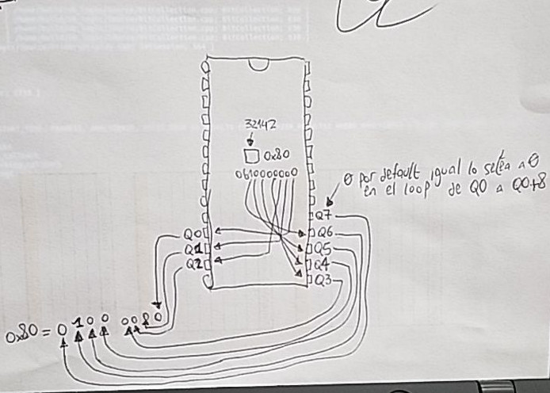

# Dumpear una ROM 101

el telefono nos trajo una ROM, unas fotitos de la susodicha:


para ver los numeritos corremos un poco el papel (sin sacarlo todo porque estos chips tienen un agujerito para grabarlos con rayos UV)


el pinout de esa memoria es:


el 512 del titulito es la cantidad de kilobits que puede soportar, si queremos saber la cantidad de kilobytes... lo tenemos que dividir por 8

por lo tanto este chip tiene soporte para:

```
>>> 512//8
64
```

64 KB de memoria, lista para ser dumpeada

* Vcc pin: derecho a +5V
* GND pin: a ground
* Vpp pin: programming voltage pin, a +5V (unless it's also one of the enable pings; see below)
* The remaining pins labelled "E", "OE", "G", "CE", etc. are pins that enable the input and outputs. All you really need to know about these is that they need to be enabled, and that they are active low. This means you tell the chip to enable these pins by hooking themup to ground, not +5V. You can tell that they're active low because they either have a hash mark (#) beside their names, or a little horizontal bar is drawn over their names.

## Breadboarding

Vcc y Vpp va a +5V, y todo lo demas que no sea A# o Q# va a ground


ahora los pins A0-A15 van del 26-41 del arduino en orden 


y Q0-Q7 desde el 2-10 del arduino mega


y ahora alimentamos los +5V y el GND a la breadboard para alimentar la placa

## Software

hay que bajar este sketch

```arduino
#include <stdint.h>

// Set MAX_ADDR to the largest address you need
// to read. For example, for the 27C512 chips,
// you'll want to use a MAX_ADDR of 65536.
// (That's 512 * 1024 / 8.)
// A 27C256 would be 256 kilobits, or 256 * 1024 / 8 =
// 32768.
#define MAX_ADDR 65536L

// On my board, I've connected pins 26-41
// to the A0-A15 lines, and pins 2-10 to the
// Q0-Q7 lines. You'll want to change these
// pin choices to match your setup.
#define A0 26
#define Q0 2

// When you're all wired up, hit the reset button
// to start dumping the hex codes.

void setup() {
  for (int i = A0; i < A0+16; i++) {
    digitalWrite(i,LOW);
    pinMode(i, OUTPUT);
  }
  for (int i = Q0; i < Q0+8; i++) {
    digitalWrite(i,HIGH);
    pinMode(i, INPUT);
  }
  Serial.begin(115200);
}

void writeAddr(uint32_t addr) {
  uint32_t mask = 0x01;
  for (int i = A0; i < A0+16; i++) {
    if ((mask & addr) != 0) {
      digitalWrite(i,HIGH);
    } else { 
      digitalWrite(i,LOW);
    }
    mask = mask << 1;
  }
}


uint8_t readByte() {
  uint8_t data = 0;
  uint8_t mask = 0x1;
  for (int i = Q0; i < Q0+8; i++) {
    if (digitalRead(i) == HIGH) {
      data |= mask;
    }
    mask = mask << 1;
  }
  return data;
}

void loop() {
  uint32_t addr = 0;
  while (addr < MAX_ADDR) {
    for (int i = 0; i < 16; i++) {
      writeAddr(addr);
      uint8_t b = readByte();
      Serial.print(b, HEX);
      Serial.print(" ");
      addr++;
    }
    Serial.println("");
  }
  while (1) {}
}
```

### setup

```arduino
#define A0 26
#define Q0 2

void setup() {
  for (int i = A0; i < A0+16; i++) {
    digitalWrite(i,LOW);
    pinMode(i, OUTPUT);
  }
  for (int i = Q0; i < Q0+8; i++) {
    digitalWrite(i,HIGH);
    pinMode(i, INPUT);
  }
  Serial.begin(115200);
}
```

como conecto el pin A0-A15 a LOW y lo setea para que tire OUTPUT. Q0-Q7 hace lo opuesto, lo pone a HIGH y los setea como INPUT, por ultimo habilita la comunicacion serial para dumpearla ahi

### loop

```arduino
// Set MAX_ADDR to the largest address you need
// to read. For example, for the 27C512 chips,
// you'll want to use a MAX_ADDR of 65536.
// (That's 512 * 1024 / 8.)
// A 27C256 would be 256 kilobits, or 256 * 1024 / 8 =
// 32768.
#define MAX_ADDR 65536L

void loop() {
  uint32_t addr = 0;
  while (addr < MAX_ADDR) {
    for (int i = 0; i < 16; i++) {
      writeAddr(addr);
      uint8_t b = readByte();
      Serial.print(b, HEX);
      Serial.print(" ");
      addr++;
    }
    Serial.println("");
  }
  while (1) {}
}
```

va hasta la direccion 65535 leyendo de a un byte, para hacer eso solo manda la direccion a leer con la funcion writeAddr

```arduino
void writeAddr(uint32_t addr) {
  uint32_t mask = 0x01;
  for (int i = A0; i < A0+16; i++) {
    if ((mask & addr) != 0) {
      digitalWrite(i,HIGH);
    } else {
      digitalWrite(i,LOW);
    }
    mask = mask << 1;
  }
}
```

son direcciones de 16 bits por mas que se le pase un uint32\_t y lo que hace el codigo es enviar la direccion que le pasemos como argumento en formato binario a los pines A0-A15, en dibujito es esto


escribe la direccion y retorna al loop donde ejecuta readByte y lo printea por consola en HEXA

```arduino
uint8_t readByte() {
  uint8_t data = 0;
  uint8_t mask = 0x1;
  for (int i = Q0; i < Q0+8; i++) {
    if (digitalRead(i) == HIGH) {
      data |= mask;
    }
    mask = mask << 1;
  }
  return data;
}
```

y para leerlo hace algo parecido, itera por las salidas Q0-Q7 leyendo en binario y va armando el uint8\_t en base a si lee un uno o un cero




